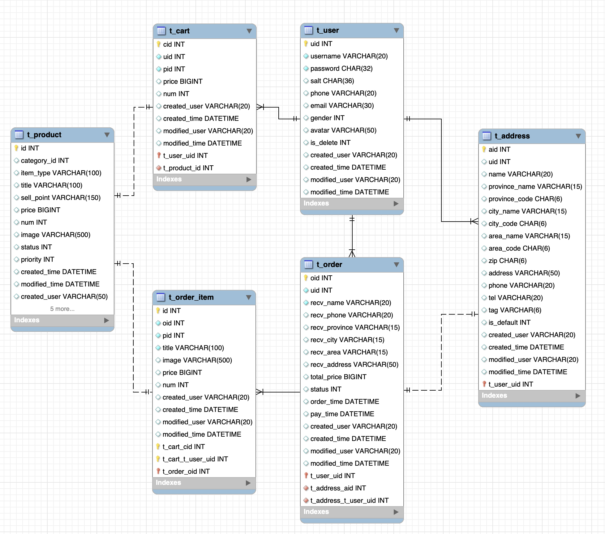
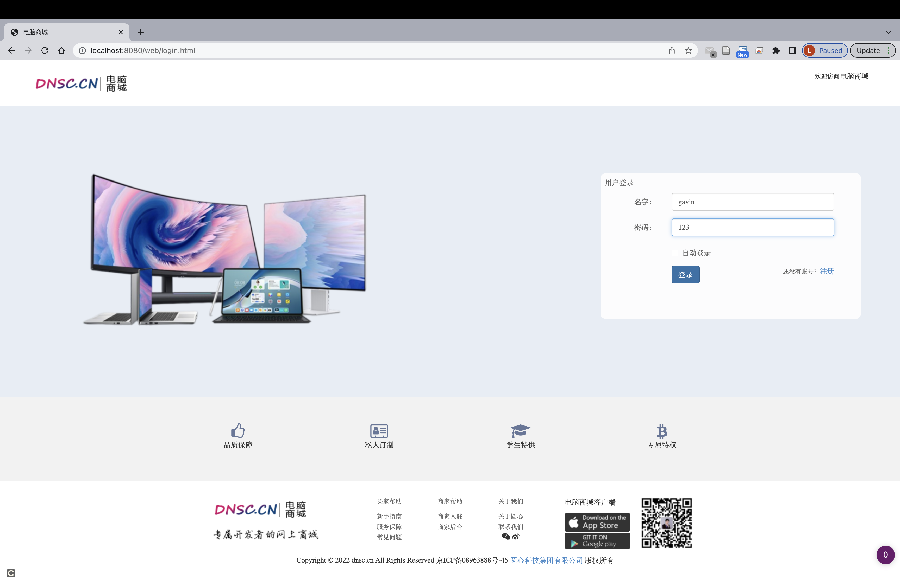
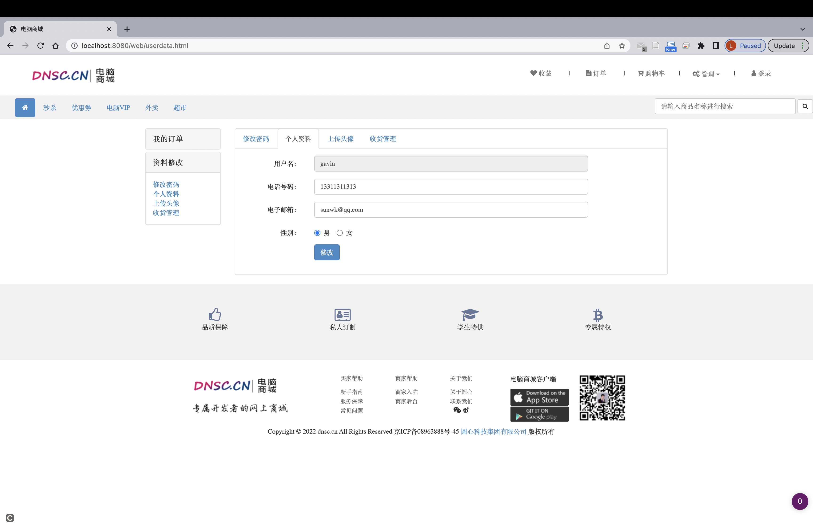
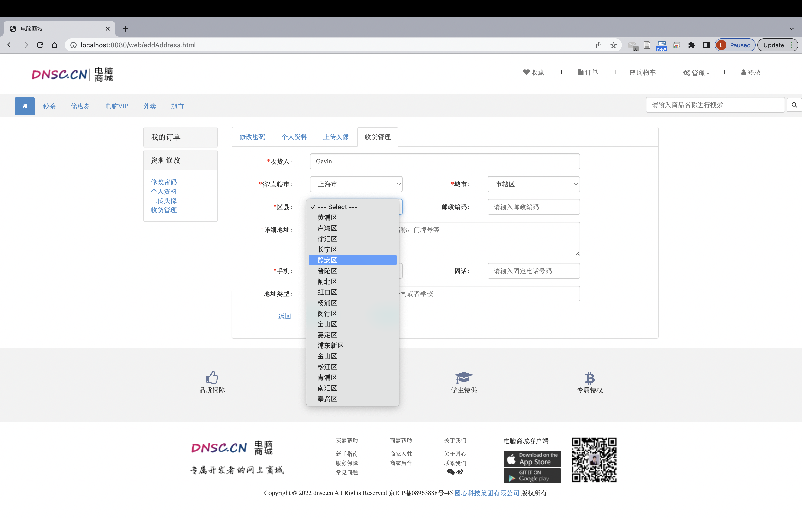
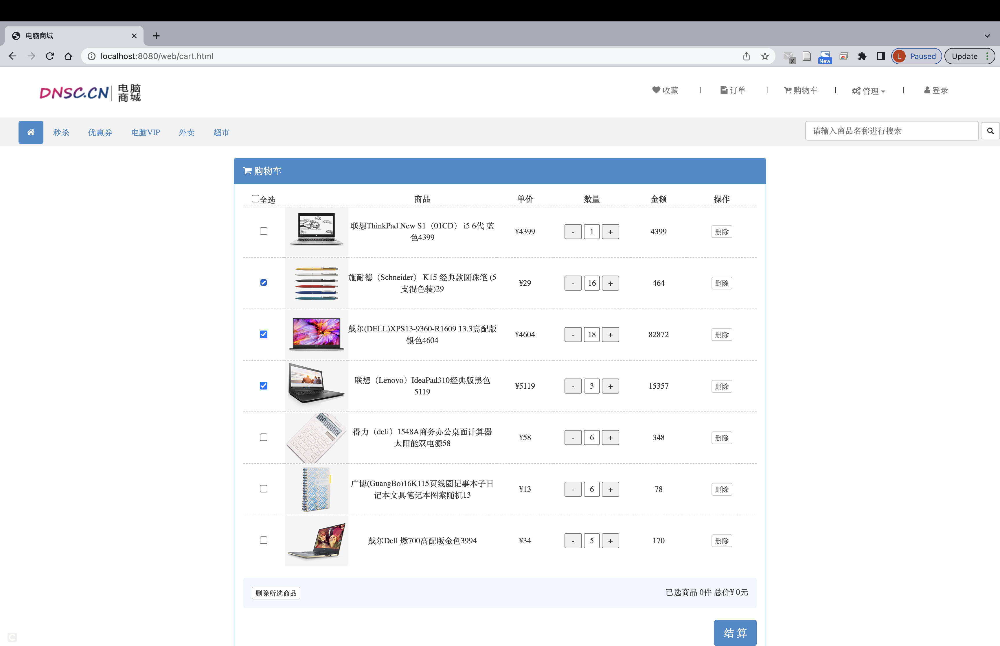
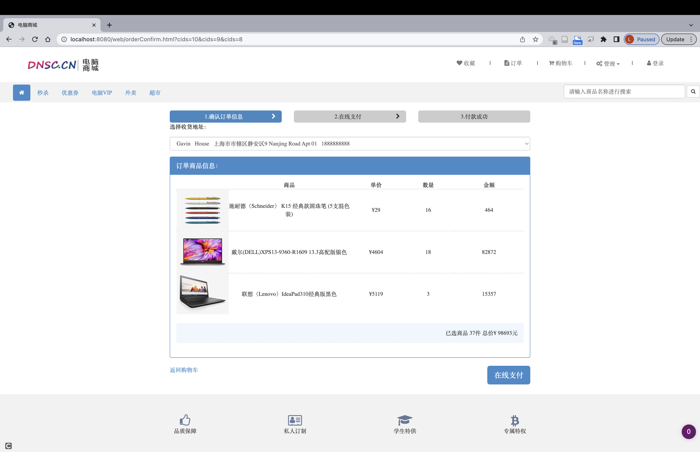

# E-Store-Spring-Boot

## Description

A full-stack web application built with Java Spring Boot and a MySQL database accessed via MyBatis.

## Features

- User register/login and profile editing
- User address management
- Session-based cart management and order generation

## Data model

## Screenshots
- User login
  
- User profile
  
- User address management
  
- Shopping cart
  
- Order generation
  
